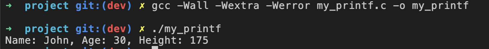

# Welcome to My Printf
***

## Task
`my_printf` is a custom implementation of the C-language `printf` 
function. It provides a way to format and print output to the console, 
similar to the standard `printf` function in C.

## Description
The `my_printf` function in this project is designed to closely mimic 
the behavior of the standard `printf` function found in the C standard 
library. It allows you to format and print text, numbers, and other data 
types to the console with various formatting options, just like `printf`.


## Installation
To use `my_printf`, you can follow these steps to compile and run the project:

1. Clone this repository to your local machine: </br>
   ```git clone <rhttps://git.us.qwasar.io/my_printf_148893_juezsp/my_printf.git>```</br>
2. Navigate to the project directory:</br>
   ```cd my_printf```</br>
3. Edit the main to include your test cases (see Usage example below). </br>
4. Compile the code:</br>
  ```gcc -Wall -Wextra -Werror my_printf.c -o my_printf```</br>
5. Run the program:</br>
   ```./my_printf```</br>
6. See the screen cap below:




</br>

## Usage
Using my_printf is very similar to using the standard printf function in C. 
You can format and print various data types and text by providing format 
specifiers and arguments. Here's a basic example of how to use my_printf by
modifying the main function:

```
int main() {
    int age = 30;
    int height = 175;
    char* name = "John";

    my_printf("Name: %s, Age: %d, Height: %d\n", name, age, height);

    return 0;
}
```
Should print:
```                                    
Name: John, Age: 30, Height: 175
```

### The Core Team
Anthea Ip