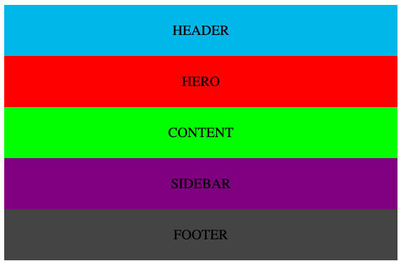

## Overview
Fun with CSS Flexboxes!
The boxes stack vertically when the view is smaller
When the view is larger, the Content and Sidebar boxes align horizontally

## Screenshots
### Large view window

### Small view window
